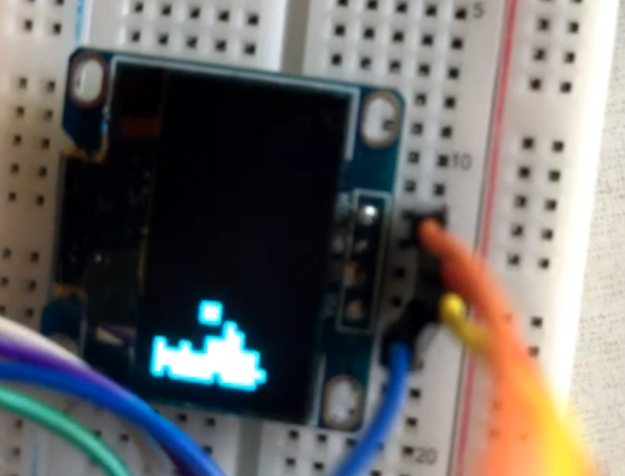

# MINI TETRIS
This is a tetris game project developed on STM32CubeIde. Developed as a homework project for GTU CSE 433 Embedded Systems.

## Parts
**Micro-Controller,** stm32f411.
**Display,** 0.96 inch i2c oled display - ssd1306.
**Input,** analog xy joystick.
**Program-Debug,** st-link v2 mini programmer.

## Circuitry

## Game Example

